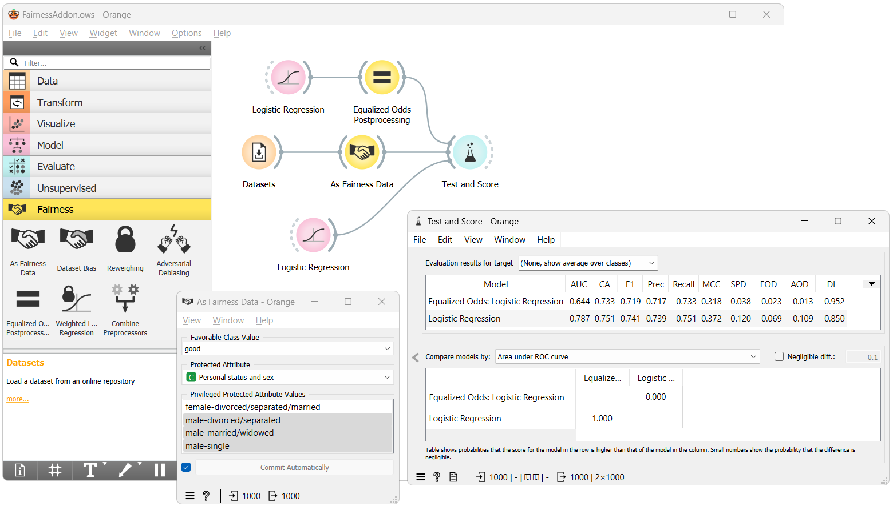

<h1 align="center">Orange3-Fairness</h1>

Fairness add-on for the [Orange](http://orange.biolab.si).

# Easy installation

First, [download](https://orange.biolab.si/download) the latest Orange release from
our website. Then, to install the fairness add-on, head to
`Options -> Add-ons...` in the menu bar.

# For developers

If you would like to install from cloned git repository, run

    pip install .

To register this add-on with Orange, but keep the code in the development directory
(do not copy it to Python's site-packages directory), run

    pip install -e .

###  Usage

After the installation, the widget from this add-on is registered with Orange. To run Orange from the terminal,
use

    orange-canvas

or

    python -m Orange.canvas

The new widget appears in the toolbox bar under the section Fairness.
Starting up for the first time may take a while.